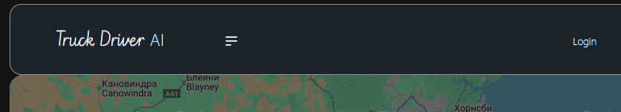
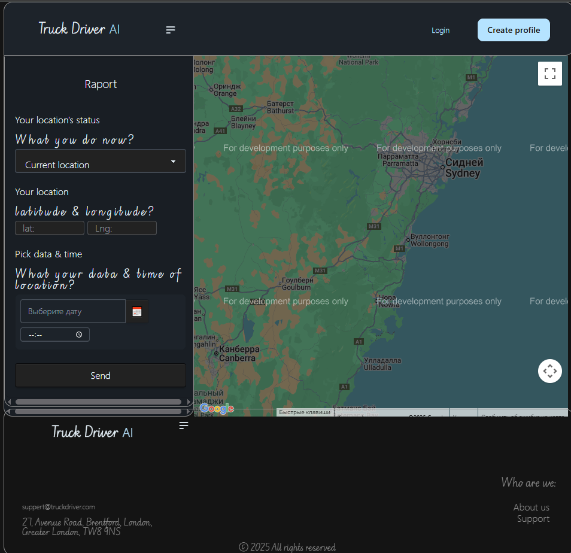

[back](https://github.com/Tryd0g0lik/truck_driver), more information.

## Refiew

Front web-app has intagration to the ChatGPT API, authentification sнstem.

Project including the:
 - google fonts.

**Example of google fonts**\


**Example of page for raport**\
Where, the Truck driver can to send raport.\


* This is the left column of the side page. 
*  'Your location's status' - it is a select of the status of the truck for which we the truck driver want will send raport.
 * 'Your location' - this is the latitude & longitude of the truck driver. location of truck in that moment when the truck driver has status from 'Your location's status'.
 * 'Pick data & time' - This is the date & time for which the truck driver has latitude & longitude and wahted to send raport
---

### Nav-bar
When user's cookie has that proporties how "`person`", we can see the next nav-bar:\


**And not have**\


## Commands

- "`npm install package.json`" install dependencies;
- "`npm run lint`" - run the check for a code style and some mistake. Plus, command the "`husk`" and "`prepare`" auto run to work after "`git commit`". "`--no-verify`" flag will cancel the check;
- "`npm run build`" - build by mode of "`production`";
- "`npm run server`" - Start the server for development;
- "`npm run watchs`" - Start server and watch for changing of your files to the mode of  "`development`", too;
- "`npm run cssstyle`" - FW Tailwind start by the beginning to work. It's listener chacnging all css and Tailwind's components from "`daisyui.com`";
- "`npm run husk`" Start before "`prepare`". Before start need create the "`pre-commit`" the by path "`*./.husky`'. In file "`pre-commit`" insert "`npm run lint`";
- "`npm run prepare`": "husky".


## FRONT
- **FW**: React, Tailwind, daisyui,  Webpack;
- **Lang**: **TypeScript**;
- **Styles**: SCSS;
- **Devices**: Mobil, tablet, laptop and Desctop

## Redux

### Redux.personstate
Properties of user/person
```ts
// src\reduxs\features\userstate\personSlice.ts
const personSlice = createSlice({
    name:"personstate",
    initialState,
    reducers:{
        resetPerson: () => {
            localStorage.removeItem("person");
        return clearState;
        },
        setPerson:(state, action: PayloadAction<StatePerson>) => {
            state = action.payload;
            return {...state};
        },
    },
});

```
```ts
// src\interfaces.ts
/**
 * This is intarface for User's status roles
 */
export enum UserStatus {
  CATEGORY_BASE = "BASE",
  CATEGORY_DRIVER = "DRIVER",
  CATEGORY_MANAGER = "SUPER_ADMIN",
  CATEGORY_CLIENT = "ANONYMOUSUSER",
  CATEGORY_ADMIN = "ADMIN"
  
}

export interface StatePerson extends DataForDAPI {
    "status": string
}

/** Statice pathname of API & pages */
export enum APIPerson {
    API__POST_REGISTERATION = "/api/auth/person/",
    API__POST_LOGIN = "/",
    API__POST_LOGOUT = "/",
    API__POST_GET_USER = "/",
    API__POST_GET_USERS = "/",
    API__POST_GET_USERS_BY_ID = "/"
};

```
Пользователь имеет два рабочих статуса. Это клиент "`USER`" страницы и аноним "`ANONYMOUSUSER`".

### Redux.metapage
Properties of meta page.
```ts
// src\reduxs\store.ts
const pageSlice = createSlice({
    name: "metapage",
    initialState: clearPageState,
    reducers: {
        resetPageMeta: () => clearPageState,
        setCurrentMeta: (state, action: PayloadAction<PageMeta>) => {
            /**
             * state.page.title = action.payload.page.title;
             * state.page.description = action.payload.page.description;
             * state.page.keywords = action.payload.page.keywords;
             * ....
             */
            state = action.payload;
            return {...state};
        },
    },
});
```
```ts
// src\interfaces.ts

 export interface PageMeta {
    page: {
        title: string,
        description: string,
        keywords: Array<string>,
        pathName: string,
    }

 }
```
Properties of page  we sending from redux. Created was a listener for work with data.
```ts
//src\components\Router\index.tsx
export const MetaListener = () => {
  const dispatch = useDispatch();

  useEffect(() => {
    const pathname =  window.location.pathname.toLowerCase().trim();
    const pageName =
      pathname.includes("register") ? "Registration" :
      pathname.includes("login") ? "For login" :"Main";

    const state: PageMeta = {
      page: {
        title: pageName,
        pathName: pathname,
        description: "",
        keywords: [],
      },
    };

    dispatch(setCurrentMeta(state));
  }, [location.pathname, dispatch]);

  return null;
};
```


## Registration form
files  [валидатороты](./src/pages/validators).
1) In start (after mouse click) all fields will check on the correct data. 

Fields if have not corretn data, receving the warn message.\


Note: Message by no valid data removing after the mouth click in field.\
Valid check\
```ts
await Promise.allSettled([
            async_regex_validate_of_username((inputUserName as HTMLInputElement).value),
            async_regex_validate_of_email((inputEmail as HTMLInputElement).value),
            async_regex_validate_of_password((inputPassword as HTMLInputElement).value),
            async_regex_validate_of_password((inputPasswordDuplicate as HTMLInputElement).value),
            (async () => ((inputPassword as HTMLInputElement).value === (inputPasswordDuplicate as HTMLInputElement).value) ? true : false)(),
            (async () => (InputCheckbox as HTMLInputElement) && (InputCheckbox as HTMLInputElement).checked ? true : false)()
        ])
```
The validation data [send to server](src/pages/components/Register/handlers/handlerForm.ts) send  to the server( "`POST-request`" ).

Records of user enters to the postgreSQL (main) and redis (cache).

### Authorisation


If you enter the correct of data (in field of form ) ,  a response from server return else data, it's:
- "`token_access`";
- "`token_refresh`"
- and "`{id: 100, last_login: '2025-08-26T10:31:15.627678+07:00', is_superuser: false, username: 'Tutu', first_name: '', …}`".


This all data be records in cookie. Data/properties of user we can use, but  we can't use tokens.